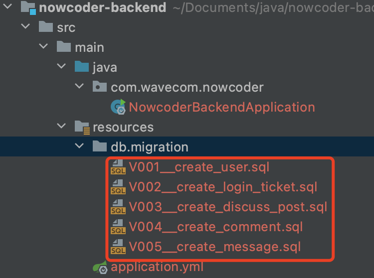
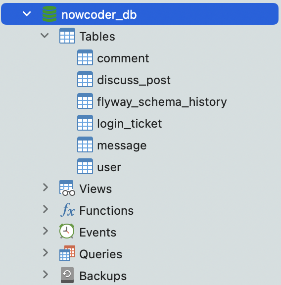

# nowcoder-backend

> 仿牛客网开发，前后端分离，后端学习笔记
>
> [原课程地址](https://www.nowcoder.com/courses/cover/live/246)

## 搭建开发环境

* 创建SpringBoot项目 `<version>2.5.7</version>`
* 添加初始依赖项

```xml
<!--web-->
<artifactId>spring-boot-starter-web</artifactId>
<!-- flyway 数据库版本管理-->
<artifactId>flyway-core</artifactId>
<!-- JSR303校验 -->
<artifactId>spring-boot-starter-validation</artifactId>
<artifactId>validation-api</artifactId>
<!-- Mybatis-Plus -->
<artifactId>mybatis-plus-boot-starter</artifactId>
<artifactId>mybatis-plus-generator</artifactId>
<artifactId>velocity-engine-core</artifactId>
<!-- MySQL Driver -->
<artifactId>mysql-connector-java</artifactId>
<!-- LOMBOK -->
<artifactId>lombok</artifactId>
<!-- test -->
<artifactId>spring-boot-starter-test</artifactId>
<!-- Swagger -->
<artifactId>springfox-swagger2</artifactId>
<artifactId>springfox-swagger-ui</artifactId>

<artifactId>commons-lang3</artifactId>
<artifactId>fastjson</artifactId>
```

* 配置`yml`文件

    * 数据库连接

    ```yml
    spring:
      datasource:
        driver-class-name: com.mysql.cj.jdbc.Driver
        username: root
        password: Eric1230
        url: jdbc:mysql://localhost:3306/nowcoder_db?createDatabaseIfNotExist=true
    ```

    * 项目端口号

    ```yml
    server:
      port: 8717
    ```

* 配置`flyway`

在`resources`路径下创建`db.migration`文件夹（添加依赖会自动生成），将需要初始化的数据库sql文件按规定格式命名（如`V00__create_user.sql`）。



* 启动项目

启动项目后，会自动创建`nowcoder_db`数据库及相应的数据表。



* 代码生成

使用Mybatis-Plus代码生成器生成`entity`、`controller`、`service`、`mapper`代码。

创建`generator.CodeGenerator`代码生成类，配置相应生成策略：

```java
    public static void main(String[] args) {
        AutoGenerator mpg = new AutoGenerator();

        GlobalConfig gc = new GlobalConfig();
        String projectPath = System.getProperty("user.dir");
        gc.setOutputDir(projectPath + "/src/main/java");
        gc.setAuthor("cdragon-ljl");
        gc.setOpen(false);
        gc.setSwagger2(true);
        gc.setServiceName("%sService");
        //定义生成的实体类中日期类型
        gc.setDateType(DateType.ONLY_DATE);
        mpg.setGlobalConfig(gc);

        DataSourceConfig dsc = new DataSourceConfig();
        dsc.setUrl("jdbc:mysql://localhost:3306/nowcoder_db?characterEncoding=utf8&useSSL=false&serverTimezone=GMT%2B8");
        dsc.setDriverName("com.mysql.cj.jdbc.Driver");
        dsc.setUsername("root");
        dsc.setPassword("Eric1230");
        mpg.setDataSource(dsc);

        PackageConfig pc = new PackageConfig();
        pc.setModuleName("nowcoder");
        pc.setParent("com.wavecom");
        pc.setController("controller");
        pc.setEntity("entity");
        pc.setService("service");
        pc.setMapper("mapper");
        mpg.setPackageInfo(pc);

        StrategyConfig strategy = new StrategyConfig();
        //设置要映射的表名(可变长度参数)
        strategy.setInclude("user", "discuss_post", "login_ticket", "comment", "message");
        strategy.setNaming(NamingStrategy.underline_to_camel);
        strategy.setEntityLombokModel(true);
        strategy.setRestControllerStyle(true);
        strategy.setControllerMappingHyphenStyle(true);
        strategy.setColumnNaming(NamingStrategy.underline_to_camel);
        mpg.setStrategy(strategy);

        mpg.execute();
    }
```

启动代码生成方法，生成完成后，效果如下图：


* 配置Mybatis-Plus

创建`config.MybatisPlusConfig`配置类，添加注解`@Configuration`，添加包扫描注解`@MapperScan`，获取分页插件Bean

```java
@Configuration
@MapperScan("com.wavecom.nowcoder.mapper")
public class MybatisPlusConfig {
    @Bean
    public PaginationInnerInterceptor paginationInnerInterceptor() {
        return new PaginationInnerInterceptor();
    }
}
```

* 配置Swagger

创建`config.SwaggerConfig`配置类，添加注解`@Configuration`，添加`EnableSwagger2`注解，配置`Docket`

```java
@Configuration
@EnableSwagger2
public class SwaggerConfig {
    @Bean
    public Docket restApi() {
        return new Docket(DocumentationType.SWAGGER_2)
                .apiInfo(apiInfo())
                .select()
                .apis(RequestHandlerSelectors.basePackage("com.wavecom.nowcoder.controller"))
                .paths(PathSelectors.any())
                .build();
    }

    private ApiInfo apiInfo() {
        return new ApiInfoBuilder()
                .title("NowcoderAPI")
                .description("仿牛客网开发，前后端分离模式")
                .contact(new Contact("cdragon-ljl", "www.cdragon.space", "15851933005@163.com"))
                .version("1.0")
                .build();
    }
}
```

运行项目，访问项目端口+`/swagger-ui.html`，本项目为`localhost:8717/swagger-ui.html`，效果如下：


由于当前尚未进行`Controller`开发，所以并未扫描到相关接口。

**至此，项目搭建完成。**

## 开发社区登录模块

### 发送邮件

### 注册功能

### 会话管理

### 生成验证码

### 登录、退出功能

### 显示登录信息

### 账号设置

### 检查登录状态


