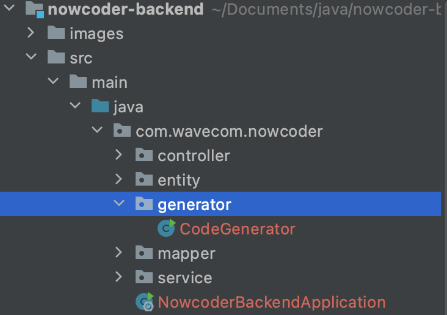
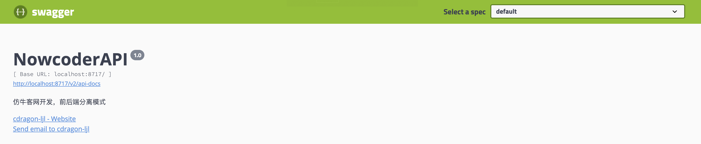
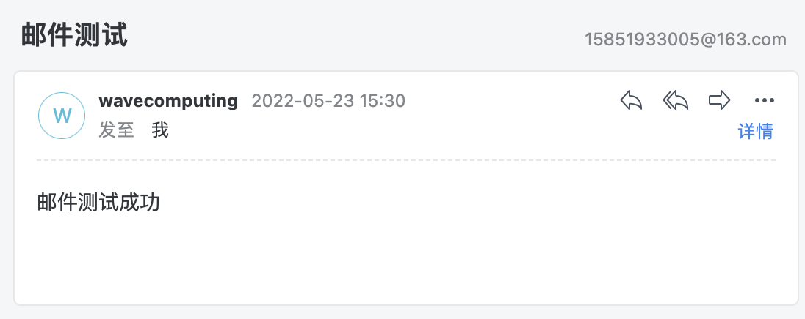
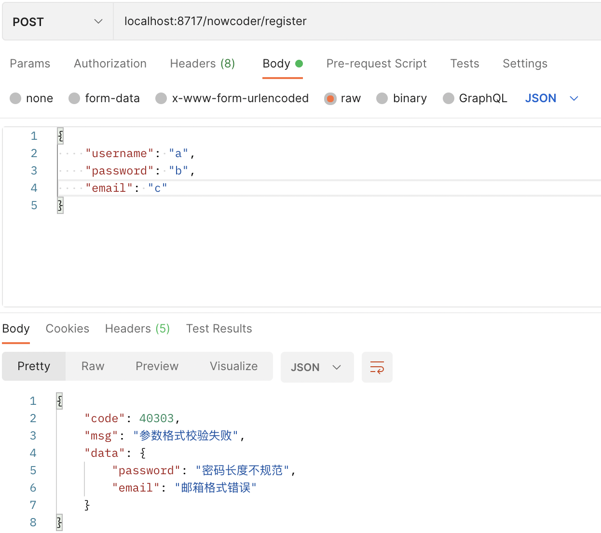
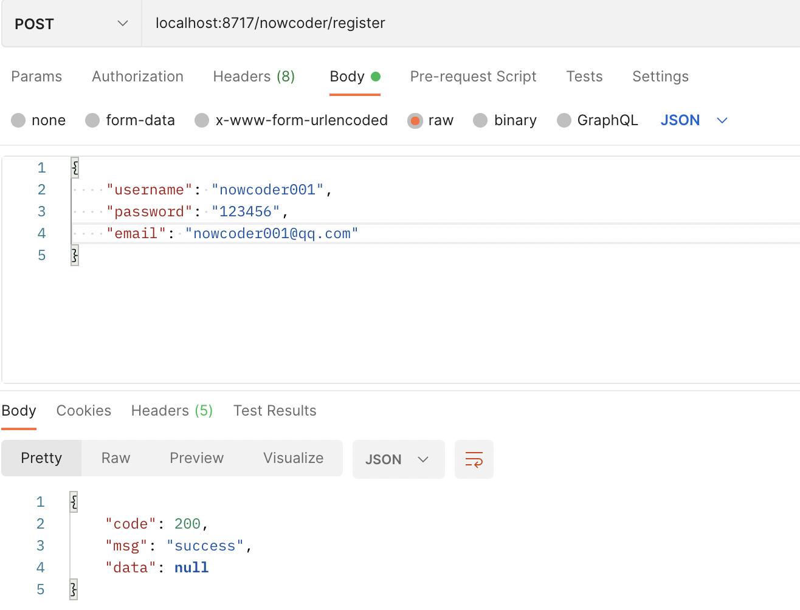
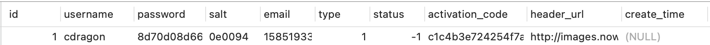
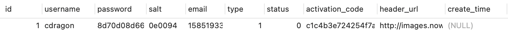
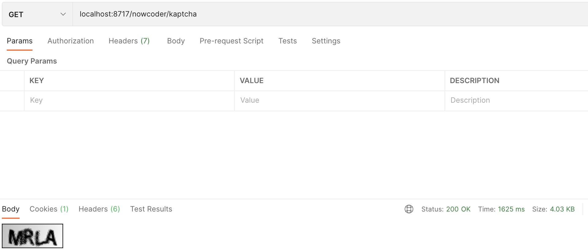

# nowcoder-backend

> 仿牛客网开发，前后端分离模式，后端学习笔记
>
> [原课程地址](https://www.nowcoder.com/courses/cover/live/246)

## 搭建开发环境

* 创建SpringBoot项目 `<version>2.5.7</version>`
* 添加初始依赖项

```xml
<!--web-->
<artifactId>spring-boot-starter-web</artifactId>
<!-- flyway 数据库版本管理-->
<artifactId>flyway-core</artifactId>
<!-- JSR303校验 -->
<artifactId>spring-boot-starter-validation</artifactId>
<artifactId>validation-api</artifactId>
<!-- Mybatis-Plus -->
<artifactId>mybatis-plus-boot-starter</artifactId>
<artifactId>mybatis-plus-generator</artifactId>
<artifactId>velocity-engine-core</artifactId>
<!-- MySQL Driver -->
<artifactId>mysql-connector-java</artifactId>
<!-- LOMBOK -->
<artifactId>lombok</artifactId>
<!-- test -->
<artifactId>spring-boot-starter-test</artifactId>
<!-- Swagger -->
<artifactId>springfox-swagger2</artifactId>
<artifactId>springfox-swagger-ui</artifactId>

<artifactId>commons-lang3</artifactId>
<artifactId>fastjson</artifactId>
```

* 配置`yml`文件

    * 数据库连接

    ```yml
    spring:
      datasource:
        driver-class-name: com.mysql.cj.jdbc.Driver
        username: root
        password: Eric1230
        url: jdbc:mysql://localhost:3306/nowcoder_db?createDatabaseIfNotExist=true
    ```

    * 项目端口号

    ```yml
    server:
      port: 8717
    ```

* 配置`flyway`

在`resources`路径下创建`db.migration`文件夹（添加依赖会自动生成），将需要初始化的数据库sql文件按规定格式命名（如`V00__create_user.sql`）。


* 启动项目

启动项目后，会自动创建`nowcoder_db`数据库及相应的数据表。


* 代码生成

使用Mybatis-Plus代码生成器生成`entity`、`controller`、`service`、`mapper`代码。

创建`generator.CodeGenerator`代码生成类，配置相应生成策略：

```java
    public static void main(String[] args) {
        AutoGenerator mpg = new AutoGenerator();

        GlobalConfig gc = new GlobalConfig();
        String projectPath = System.getProperty("user.dir");
        gc.setOutputDir(projectPath + "/src/main/java");
        gc.setAuthor("cdragon-ljl");
        gc.setOpen(false);
        gc.setSwagger2(true);
        gc.setServiceName("%sService");
        //定义生成的实体类中日期类型
        gc.setDateType(DateType.ONLY_DATE);
        mpg.setGlobalConfig(gc);

        DataSourceConfig dsc = new DataSourceConfig();
        dsc.setUrl("jdbc:mysql://localhost:3306/nowcoder_db?characterEncoding=utf8&useSSL=false&serverTimezone=GMT%2B8");
        dsc.setDriverName("com.mysql.cj.jdbc.Driver");
        dsc.setUsername("root");
        dsc.setPassword("Eric1230");
        mpg.setDataSource(dsc);

        PackageConfig pc = new PackageConfig();
        pc.setModuleName("nowcoder");
        pc.setParent("com.wavecom");
        pc.setController("controller");
        pc.setEntity("entity");
        pc.setService("service");
        pc.setMapper("mapper");
        mpg.setPackageInfo(pc);

        StrategyConfig strategy = new StrategyConfig();
        //设置要映射的表名(可变长度参数)
        strategy.setInclude("user", "discuss_post", "login_ticket", "comment", "message");
        strategy.setNaming(NamingStrategy.underline_to_camel);
        strategy.setEntityLombokModel(true);
        strategy.setRestControllerStyle(true);
        strategy.setControllerMappingHyphenStyle(true);
        strategy.setColumnNaming(NamingStrategy.underline_to_camel);
        mpg.setStrategy(strategy);

        mpg.execute();
    }
```

启动代码生成方法，生成完成后，效果如下图：



* 配置Mybatis-Plus

创建`config.MybatisPlusConfig`配置类，添加注解`@Configuration`，添加包扫描注解`@MapperScan`，获取分页插件Bean

```java
@Configuration
@MapperScan("com.wavecom.nowcoder.mapper")
public class MybatisPlusConfig {
    @Bean
    public PaginationInnerInterceptor paginationInnerInterceptor() {
        return new PaginationInnerInterceptor();
    }
}
```

* 配置Swagger

创建`config.SwaggerConfig`配置类，添加注解`@Configuration`，添加`EnableSwagger2`注解，配置`Docket`

```java
@Configuration
@EnableSwagger2
public class SwaggerConfig {
    @Bean
    public Docket restApi() {
        return new Docket(DocumentationType.SWAGGER_2)
                .apiInfo(apiInfo())
                .select()
                .apis(RequestHandlerSelectors.basePackage("com.wavecom.nowcoder.controller"))
                .paths(PathSelectors.any())
                .build();
    }

    private ApiInfo apiInfo() {
        return new ApiInfoBuilder()
                .title("NowcoderAPI")
                .description("仿牛客网开发，前后端分离模式")
                .contact(new Contact("cdragon-ljl", "www.cdragon.space", "15851933005@163.com"))
                .version("1.0")
                .build();
    }
}
```

运行项目，访问项目端口+`/swagger-ui.html`，本项目为`localhost:8717/swagger-ui.html`，效果如下：



由于当前尚未进行`Controller`开发，所以并未扫描到相关接口。

* 添加统一结果返回类

创建`result.Result`统一结果返回类：

```java
@Data
@NoArgsConstructor
@AllArgsConstructor
public class Result<T> {
    private int code;
    private String msg;
    private T data;

    public Result(int code, String msg) {
        this.code = code;
        this.msg = msg;
    }

    /**
     * default ok
     * @return 200, success
     */
    public static Result ok() {
        return new Result(200, "success");
    }

    /**
     * ok with data
     * @return 200, success, data
     */
    public static Result ok(Object data) {
        return new Result(200, "success", data);
    }

    /**
     * default error
     * @return 400, error
     */
    public static Result error() {
        return new Result(400, "error");
    }

    /**
     * error with code, msg
     * @return code, msg
     */
    public static Result error(int code, String msg) {
        return new Result(code, msg);
    }

    /**
     * error with code, msg, data
     * @return code, msg, data
     */
    public static Result error(int code, String msg, Object data) {
        return new Result(code, msg, data);
    }
}
```

* 创建工具类

创建`utils.NowCoderUtil`工具类：

```java
public class NowCoderUtil {

    /**
     * 生成随机字符串
     * @return
     */
    public static String generateUUID() {
        return UUID.randomUUID().toString().replaceAll("-", "");
    }
    
    /**
     * MD5加密
     * @param key
     * @return
     */
    public static String md5(String key) {
        if (StringUtils.isBlank(key)) {
            return null;
        }

        return DigestUtils.md5DigestAsHex(key.getBytes(StandardCharsets.UTF_8));
    }

    /**
     * 获得JSON格式字符串
     * @param code 编号
     * @param msg 提示信息
     * @param map 业务数据
     */
    public static String getJSONString(int code, String msg, Map<String, Object> map) {
        JSONObject json = new JSONObject();
        json.put("code", code);
        json.put("msg", msg);
        if (map != null) {
            for (String key : map.keySet()) {
                json.put(key, map.get(key));
            }
        }
        return json.toJSONString();
    }

    /**
     * 重载: 没有业务数据
     * 获得JSON格式字符串
     * @param code 编号
     * @param msg 提示信息
     */
    public static String getJSONString(int code, String msg) {
        return getJSONString(code, msg, null);
    }

    /**
     * 重载: 没有业务数据, 只有code
     * 获得JSON格式字符串
     * @param code 编号
     */
    public static String getJSONString(int code) {
        return getJSONString(code, null, null);
    }
}
```

* 创建常用常量接口

创建`utils.NowCoderConstant`接口类：

```java
public interface NowCoderConstant {
    /** 激活成功 */
    int ACTIVATION_SUCCESS = 0;

    /** 重复激活 */
    int ACTIVATION_REPEAT = 1;

    /** 激活失败 */
    int ACTIVATION_FAILED = 2;

    /** 默认状态的登录凭证的超时时间 12小时 */
    int DEFAULT_EXPIRED_SECONDS = 3600 * 12;

    /** 记住状态下的登录凭证超时时间 100天 */
    int REMEMBER_EXPIRED_SECONDS = 3600 * 24 * 100;

    /** 实体类型：帖子 */
    int ENTITY_TYPE_POST = 1;

    /** 实体类型：评论 */
    int ENTITY_TYPE_COMMENT = 2;

    /** 实体类型：用户 */
    int ENTITY_TYPE_USER = 3;

    /** 主题：评论 */
    String TOPIC_COMMENT = "comment";

    /** 主题：点赞 */
    String TOPIC_LIKE = "like";

    /** 主题：关注 */
    String TOPIC_FOLLOW = "follow";

    /** 主题：发帖 */
    String TOPIC_PUBLISH = "publish";

    /** 主题：分享 */
    String TOPIC_SHARE = "share";

    /** 删除 */
    String TOPIC_DELETE = "delete";

    /** 系统用户id */
    int SYSTEM_USER_ID = 1;

    /** 权限：普通用户 */
    String AUTHORITY_USER = "user";

    /** 权限：管理员 */
    String AUTHORITY_ADMIN = "admin";

    /** 权限：版主 */
    String AUTHORITY_MODERATOR = "moderator";
}
```

**至此，项目搭建完成。**

## 开发社区登录模块

### 发送邮件

* 添加邮件依赖

```xml
<dependency>
    <groupId>org.springframework.boot</groupId>
    <artifactId>spring-boot-starter-mail</artifactId>
</dependency>
```

* 配置邮箱信息

可以使用常用的邮箱，在邮箱客户端查询账户相应信息

```yml
  mail:
    host: smtp.sina.com
    port: 465
    username: wavecomputing@sina.com
    password: 6f13715f61880a8b
    protocol: smtps
    properties:
      mail:
        smtp:
          ssl:
            enable: true
```

* 编写邮箱工具类

创建`utils.MailUtil`邮箱工具类：

```java
@Slf4j
@Component
public class MailUtil {
    @Autowired
    private JavaMailSender mailSender;

    @Value("${spring.mail.username}")
    private String from;

    public void sendMail(String to, String subject, String content) {
        MimeMessage message = mailSender.createMimeMessage();
        MimeMessageHelper helper = new MimeMessageHelper(message);
        try {
            helper.setFrom(from);
            helper.setTo(to);
            helper.setSubject(subject);
            helper.setText(content, true);
            mailSender.send(helper.getMimeMessage());
        } catch (MessagingException e) {
            e.printStackTrace();
            log.error("发送邮箱失败:" + e.getMessage());
        }
    }
}
```

邮件测试：

```java
@SpringBootTest
class NowcoderBackendApplicationTests {

    @Autowired
    private MailUtil mailUtil;

    @Test
    void emailTest() {
        mailUtil.sendMail("15851933005@163.com", "邮件测试", "邮件测试成功");
    }

    @Test
    void contextLoads() {
    }
}
```



### 注册功能

* 用户注册模型

用户注册三要素：**用户名、密码、邮箱。**

创建`vo.RegisterVO`注册VO模型类，添加**JSR303**检验：

> 注意：当前项目SpringBoot版本较新，需同时添加`spring-boot-starter-validation`及`javax-validation`依赖，JSR303校验才会生效！

```java
@Data
public class RegisterVO {
    @NotBlank(message = "用户名不能为空")
    private String username;
    
    @NotBlank(message = "密码不能为空")
    @Size(message = "密码长度不规范", min = 4, max = 10)
    private String password;
    
    @NotBlank(message = "邮箱不能为空")
    @Email(message = "邮箱格式错误")
    private String email;
}
```

* 配置JSR303

创建`exception.BizCodeEnum`错误代码枚举类：

```java
public enum BizCodeEnum {
    UNKNOWN_EXCEPTION(40000, "系统未知异常"),
    VALID_EXCEPTION(40303, "参数格式校验失败");

    private int code;
    private String msg;
    BizCodeEnum(int code, String msg) {
        this.code = code;
        this.msg = msg;
    }

    public int getCode() {
        return code;
    }

    public String getMsg() {
        return msg;
    }
}
```

* 创建Controller异常类

创建`controller.advice.ControllerAdvice`类：

```java
@Slf4j
@RestControllerAdvice("com.wavecom.nowcoder.controller")
public class ControllerAdvice {
    /**
     * JSR303校验异常
     * @param e
     * @return
     */
    @ExceptionHandler(value = MethodArgumentNotValidException.class)
    public Result handleValidException(MethodArgumentNotValidException e) {
        log.error("数据校验出现问题{}，异常类型为{}", e.getMessage(), e.getClass());
        BindingResult bindingResult = e.getBindingResult();
        Map<String, String> map = new HashMap<>();
        List<FieldError> fieldErrors = bindingResult.getFieldErrors();
        fieldErrors.forEach(fieldError -> {
            map.put(fieldError.getField(), fieldError.getDefaultMessage());
        });
        return Result.error(BizCodeEnum.VALID_EXCEPTION.getCode(), BizCodeEnum.VALID_EXCEPTION.getMsg(), map);
    }

    /**
     * 全局异常
     * @param t
     * @return
     */
    @ExceptionHandler(value = Throwable.class)
    public Result handleValidException(Throwable t) {
        return Result.error(BizCodeEnum.UNKNOWN_EXCEPTION.getCode(), BizCodeEnum.UNKNOWN_EXCEPTION.getMsg());
    }
}
```

* 测试JSR303校验

创建`controller.LoginController`登录注册类，编写注册方法：

```java
@Api
@RestController
@RequestMapping("/nowcoder")
public class LoginController {

    @ApiOperation("register")
    @PostMapping("/register")
    public Result register(@Validated @RequestBody RegisterVO registerVO) {
        return Result.ok();
    }
}
```

使用Postman进行测试：

**校验失败：**



**校验成功：**



* 注册发送激活邮件

```java
    @ApiOperation("register")
    @PostMapping("/register")
    public Result register(@Validated @RequestBody RegisterVO registerVO) {
        return userService.register(registerVO);
    }
```

```java
    @Override
    public Result register(RegisterVO registerVO) {
        User user = new User();
        BeanUtils.copyProperties(registerVO, user);
        //判断用户名是否存在
        User one = baseMapper.selectOne(new QueryWrapper<User>().eq("username", user.getUsername()));
        if (one != null) {
            return Result.error("用户名已存在");
        }
        //判断邮箱是否存在
        one = baseMapper.selectOne(new QueryWrapper<User>().eq("email", user.getEmail()));
        if (one != null) {
            return Result.error("邮箱已存在");
        }
        //开始注册
        user.setSalt(NowCoderUtil.generateUUID().substring(0, 6));
        user.setPassword(NowCoderUtil.md5(user.getPassword() + user.getSalt()));
        //普通用户
        user.setType(NowCoderConstant.USER_TYPE_NORMAL);
        //未激活
        user.setStatus(NowCoderConstant.ACTIVATION_NOT);
        //生成激活码
        user.setActivationCode(NowCoderUtil.generateUUID());
        user.setHeaderUrl(String.format("http://images.nowcoder.com/head/%dt.png",
                new Random().nextInt(100)));
        user.setCreateTime(new Date());

        baseMapper.insert(user);

        //--------------激活邮件-----------------
        String url = domain  + "/activation/" +
                user.getId() + "/" + user.getActivationCode();
        String content = "Click to Activation : " + url;
        mailUtil.sendMail(user.getEmail(), "激活账号", content);

        return Result.ok("注册成功");
    }
```

注册后收到邮件：


此时查看数据库，新增了一条记录，状态为**未激活**：



* 激活账号

编写激活方法`activation`：

```java
    @ApiOperation("activation")
    @GetMapping("/activation/{id}/{code}")
    public Result activation(@PathVariable("id") int id, @PathVariable("code") String code) {
        return userService.activation(id, code);
    }
```

```java
    @Override
    public Result activation(int id, String code) {
        User user = baseMapper.selectOne(new QueryWrapper<User>().eq("id", id));
        if (user.getStatus() == NowCoderConstant.ACTIVATION_REPEAT) {
            return Result.error("重复激活");
        }
        if (user.getActivationCode().equals(code)) {
            baseMapper.update(user, new UpdateWrapper<User>().eq("id", id)
                    .set("status", NowCoderConstant.ACTIVATION_SUCCESS));
            return Result.ok("激活成功");
        } else {
            return Result.error("激活失败");
        }
    }
```

访问邮箱中的url地址进行激活，账号激活后，查看数据库，状态为激活成功：



### 会话管理

HTTP是无状态的，在同一个连接中，两个执行成功的请求之间是没有关系的，用户没有办法在同一个网站中进行连续的交互。使用HTTP的头部扩展，HTTP Cookies可以解决，把Cookies添加到头部中，创建一个会话让每次请求都能共享相同的上下文信息，达成相同的状态。

* HTTP的基本性质
    * HTTP是简单的
    * HTTP是可扩展的
    * HTTP是无状态，有会话的
* Cookie
    * 服务器发送到浏览器，并保存在浏览器端的一小块数据
    * 浏览器下次访问该服务器时，会自动携带该块数据，将其发送给服务器
* Session
    * JavaEE的标准，用于在服务器记录客户端信息
    * 数据存放在服务端更加安全，但是也会增加服务端的内存压力

### 生成验证码

* 导入Kaptcha依赖

```xml
        <dependency>
            <groupId>com.github.penggle</groupId>
            <artifactId>kaptcha</artifactId>
            <version>2.3.2</version>
        </dependency>
```

* 配置Kaptcha

创建`config.KaptchaConfig`配置类：

```java
@Configuration
public class KaptchaConfig {
    @Bean
    public Producer kaptchaProducer() {
        Properties properties = new Properties();
        properties.setProperty("kaptcha.image.width", "100");
        properties.setProperty("kaptcha.image.height", "40");
        properties.setProperty("kaptcha.textproducer.font.size", "32");
        properties.setProperty("kaptcha.textproducer.font.color", "0,0,0");
        properties.setProperty("kaptcha.textproducer.char.string", "0123456789ABCDEFGHIJKLMNOPQRSTUVWXYZ");
        properties.setProperty("kaptcha.textproducer.char.length", "4");
        properties.setProperty("kaptcha.noise.impl", "com.google.code.kaptcha.impl.NoNoise");

        DefaultKaptcha kaptcha = new DefaultKaptcha();
        Config config = new Config(properties);
        kaptcha.setConfig(config);

        return kaptcha;
    }
}
```

* 实现获取验证码功能

```java
    @ApiOperation("获取验证码")
    @GetMapping("/kaptcha")
    public void getKaptcha(HttpServletResponse response, HttpSession session) {
        //生成验证码文本及图片
        String text = kaptchaProducer.createText();
        BufferedImage image = kaptchaProducer.createImage(text);

        //将验证码存入Session
        session.setAttribute("kaptcha", text);

        //将图片输出给浏览器
        response.setContentType("image/png");

        try {
            OutputStream outputStream = response.getOutputStream();
            ImageIO.write(image, "png", outputStream);
        } catch (IOException e) {
            log.error("响应验证码失败：" + e.getMessage());
        }
    }
```

访问测试：



### 登录、退出功能

* 创建登陆模型

创建`vo.LoginVO`登陆模型类：

```java
@Data
public class LoginVO {
    @NotBlank(message = "用户名不能为空")
    private String username;
    @NotBlank(message = "密码不能为空")
    private String password;
    @NotBlank(message = "验证码不能为空")
    private String code;
    private Boolean remerberMe;
}
```

> 密码使用MD5加密。
>
> * 登录时
>     * 验证账号、密码、验证码
>     * 成功时，生成登录凭证，发放给客户端
>     * 失败时，跳转回登录页
> * 退出时：
>     * 将登录凭证修改为失效状态
>     * 跳转至网站首页

* 实现登录

编写`login`方法：

```java
    @Override
    public Map<String, Object> login(LoginVO loginVO, long expiration) {
        Map<String, Object> map = new HashMap<>();
        User user = baseMapper.selectOne(new QueryWrapper<User>().eq("username", loginVO.getUsername()));
        if (user == null) {
            map.put("message", "用户不存在");
            return map;
        }
        if (user.getStatus() != NowCoderConstant.ACTIVATION_SUCCESS) {
            map.put("message", "用户未激活");
            return map;
        }
        String password = NowCoderUtil.md5(loginVO.getPassword() + user.getSalt());
        if (!user.getPassword().equals(password)) {
            map.put("message", "密码错误");
            return map;
        }
        //生成登陆凭证
        LoginTicket loginTicket = new LoginTicket();
        loginTicket.setUserId(user.getId());
        loginTicket.setTicket(NowCoderUtil.generateUUID());
        loginTicket.setStatus(NowCoderConstant.LOGIN_TICKET_VALID);
        loginTicket.setExpired(new Date(System.currentTimeMillis() + expiration));

        loginTicketService.save(loginTicket);

        map.put("message", "登录成功");
        map.put("ticket", loginTicket.getTicket());

        return map;
    }
```

```java
    @ApiOperation("登陆")
    @PostMapping("/login")
    public Result login(@Validated @RequestBody LoginVO loginVO, HttpSession session, HttpServletResponse response) {
        String kaptcha = (String) session.getAttribute("kaptcha");
        if (!kaptcha.equals(loginVO.getCode())) {
            return Result.error("验证码错误");
        }
        long expiration = loginVO.getRemerberMe() ? NowCoderConstant.REMEMBER_EXPIRED_SECONDS
                : NowCoderConstant.DEFAULT_EXPIRED_SECONDS;
        Map<String, Object> map = userService.login(loginVO, expiration);
        if (map.containsKey("ticket")) {
            Cookie cookie = new Cookie("ticket", map.get("ticket").toString());
            cookie.setPath(contextPath);
            cookie.setMaxAge((int) expiration);

            response.addCookie(cookie);
            return Result.ok(map.get("message").toString());
        }
        return Result.error(map.get("message").toString());
    }
```

登录测试成功。

* 实现退出

编写`logout`方法：

```java
    @Override
    public void logout(String ticket) {
        loginTicketService.update(new UpdateWrapper<LoginTicket>().eq("ticket", ticket).set("status", NowCoderConstant.LOGIN_TICKET_INVALID));
    }
```

```java
    @ApiOperation("退出登录")
    @GetMapping("/logout")
    public Result logout(@CookieValue("ticket") String ticket) {
        userService.logout(ticket);
        return Result.ok("退出成功");
    }
```

### 显示登录信息

> 使用拦截器实现：定义拦截器->实现`HandlerInterceptor`接口->配置拦截器，指定拦截、排除的路径
>
> 拦截器应用：
>
> * 在请求开始时查询登录用户
> * 在请求过程中持有用户数据
> * 在请求结束时清理用户数据

* 拦截器方法

```java
@Slf4j
@Component
public class LoginTicketInterceptor implements HandlerInterceptor {
    @Autowired
    private UserService userService;

    @Autowired
    private LoginTicketService loginTicketService;

    @Autowired
    private HostUtil hostUtil;

    @Override
    public boolean preHandle(HttpServletRequest request, HttpServletResponse response, Object handler) throws Exception {
        String ticket = CookieUtil.getValue(request, "ticket");
        if (ticket != null) {
            LoginTicket loginTicket = loginTicketService.selectByTicket(ticket);
            if (loginTicket != null
                    && loginTicket.getStatus() == NowCoderConstant.LOGIN_TICKET_VALID
                    && loginTicket.getExpired().after(new Date())) {
                User user = userService.selectById(loginTicket.getUserId());
                log.info(user.getUsername() + "start");
                hostUtil.setUser(user);
            }
        }
        return true;
    }

    @Override
    public void postHandle(HttpServletRequest request, HttpServletResponse response, Object handler, ModelAndView modelAndView) throws Exception {
        User user = hostUtil.getUser();
        if (user != null) {
            log.info(user.getUsername() + "over");
        }
    }

    @Override
    public void afterCompletion(HttpServletRequest request, HttpServletResponse response, Object handler, Exception ex) throws Exception {
        hostUtil.clear();
    }
}
```

* 配置拦截器

创建`config.WebMvcConfig`拦截器配置类，配置拦截器：

```java
@Configuration
public class WebMvcConfig implements WebMvcConfigurer {
    @Autowired
    private LoginTicketInterceptor loginTicketInterceptor;

    @Override
    public void addInterceptors(InterceptorRegistry registry) {
        registry.addInterceptor(loginTicketInterceptor).addPathPatterns("/**");
    }

}
```

### 账号设置

* 用户上传头像

上传头像，向服务器发送POST请求，表单格式为`multipart/form-data"

在`UserController`中编写文件上传方法：

```java
    @ApiOperation("上传头像")
    @PostMapping("/setting")
    public Result uploadHeader(MultipartFile headerImage) {
        if (headerImage == null) {
            return Result.error("请选择要上传的头像");
        }
        String filename = headerImage.getOriginalFilename();
        String suffix = filename.substring(filename.lastIndexOf("."));
        if (StringUtils.isBlank(suffix)) {
            return Result.error("文件格式错误");
        }
        //生成随机文件名
        filename = NowCoderUtil.generateUUID() + suffix;
        String projectPath = System.getProperty("user.dir");
        String headerUrl = projectPath  + headerPath + "/" + filename;
        File dest = new File(headerUrl);
        try {
            //上传文件
            headerImage.transferTo(dest);
        } catch (IOException e) {
            log.error("文件上传失败：" + e.getMessage());
            throw new RuntimeException("文件上传失败");
        }
        User user = hostUtil.getUser();
        boolean update = userService.updateHeaderById(user.getId(), headerUrl);

        return update ? Result.ok("头像上传成功") : Result.error("头像上传失败");
    }
```

* 查看头像

在`UserController`中编写查看头像方法：

```java
    @ApiOperation("查看头像")
    @GetMapping("/header/{id}")
    public void getHeader(@PathVariable("id") int id, HttpServletResponse response) {
        String filename = userService.selectHeaderById(id);
        String suffix = filename.substring(filename.lastIndexOf("."));
        response.setContentType("image/" + suffix);
        try (
                FileInputStream inputStream = new FileInputStream(filename);
                ServletOutputStream outputStream = response.getOutputStream();
                ) {
            byte[] bytes = new byte[1024];
            int b = 0;
            while ((b = inputStream.read(bytes)) != -1) {
                outputStream.write(bytes, 0, b);
            }
        } catch (IOException e) {
            log.error("读取头像失败");
        }
    }
```

### 检查登录状态

防止未登录访问某些资源，可以使用拦截器和注解实现。

创建`annotation.LoginRequired`注解：

```java
@Target(ElementType.METHOD)
@Retention(RetentionPolicy.RUNTIME)
public @interface LoginRequired {
    
}
```

创建`controller.interceptor.LoginRequiredInterceptor`拦截器：

```java
@Slf4j
@Component
public class LoginRequiredInterceptor implements HandlerInterceptor {
    @Autowired
    private HostUtil hostUtil;

    @Override
    public boolean preHandle(HttpServletRequest request, HttpServletResponse response, Object handler) throws Exception {
        //保证拦截的是方法
        if (handler instanceof HandlerMethod) {
            HandlerMethod handlerMethod = (HandlerMethod) handler;
            Method method = handlerMethod.getMethod();
            LoginRequired loginRequired = method.getAnnotation(LoginRequired.class);
            if (loginRequired != null && hostUtil.getUser() == null) {
                log.error("用户未登录");
                return false;
            }
        }
        return true;
    }
}
```

在需要登录状态的方法上添加`LoginRequired`注解。

在`config.WebMvcConfig`配置类中添加拦截器：

```java
        registry.addInterceptor(loginRequiredInterceptor).addPathPatterns("/**");
```

## 开发社区核心功能

### 过滤敏感词

### 发布帖子

### 帖子详情

### 事务管理

### 显示评论

### 添加评论

### 私信列表

### 发送私信

### 统一异常处理

### 统一记录日志


