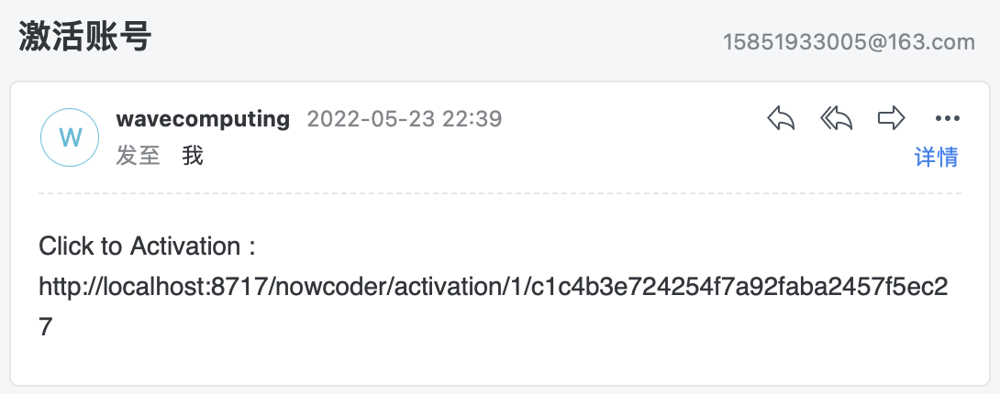
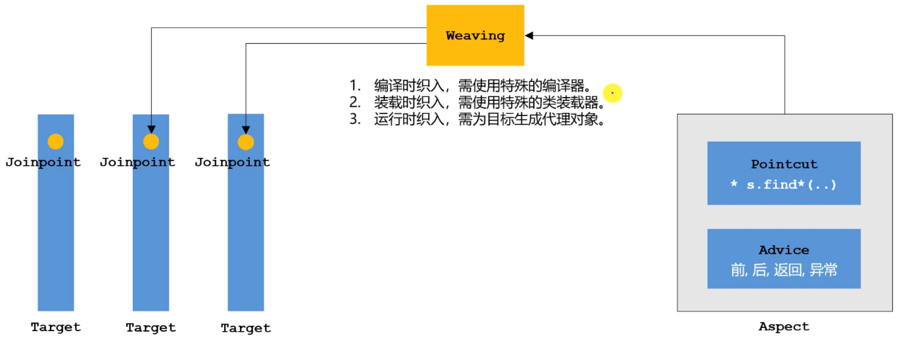
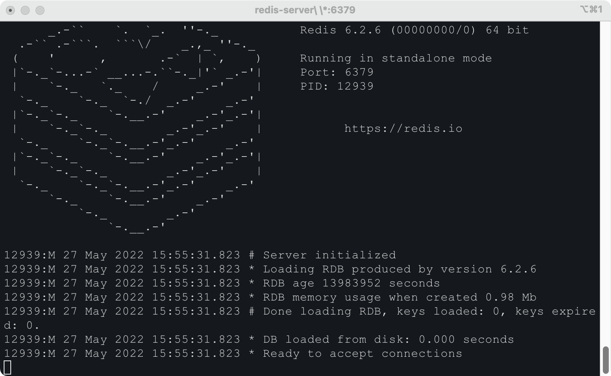

# nowcoder-backend

> 仿牛客网开发，前后端分离模式，后端学习笔记
>
> [原课程地址](https://www.nowcoder.com/courses/cover/live/246)

## 搭建开发环境

* 创建SpringBoot项目 `<version>2.5.7</version>`
* 添加初始依赖项

```xml
<!--web-->
<artifactId>spring-boot-starter-web</artifactId>
<!-- flyway 数据库版本管理-->
<artifactId>flyway-core</artifactId>
<!-- JSR303校验 -->
<artifactId>spring-boot-starter-validation</artifactId>
<artifactId>validation-api</artifactId>
<!-- Mybatis-Plus -->
<artifactId>mybatis-plus-boot-starter</artifactId>
<artifactId>mybatis-plus-generator</artifactId>
<artifactId>velocity-engine-core</artifactId>
<!-- MySQL Driver -->
<artifactId>mysql-connector-java</artifactId>
<!-- LOMBOK -->
<artifactId>lombok</artifactId>
<!-- test -->
<artifactId>spring-boot-starter-test</artifactId>
<!-- Swagger -->
<artifactId>springfox-swagger2</artifactId>
<artifactId>springfox-swagger-ui</artifactId>

<artifactId>commons-lang3</artifactId>
<artifactId>fastjson</artifactId>
```

* 配置`yml`文件

    * 数据库连接

    ```yml
    spring:
      datasource:
        driver-class-name: com.mysql.cj.jdbc.Driver
        username: root
        password: Eric1230
        url: jdbc:mysql://localhost:3306/nowcoder_db?createDatabaseIfNotExist=true
    ```

    * 项目端口号

    ```yml
    server:
      port: 8717
    ```

* 配置`flyway`

在`resources`路径下创建`db.migration`文件夹（添加依赖会自动生成），将需要初始化的数据库sql文件按规定格式命名（如`V00__create_user.sql`）。


* 启动项目

启动项目后，会自动创建`nowcoder_db`数据库及相应的数据表。


* 代码生成

使用Mybatis-Plus代码生成器生成`entity`、`controller`、`service`、`mapper`代码。

创建`generator.CodeGenerator`代码生成类，配置相应生成策略：

```java
    public static void main(String[] args) {
        AutoGenerator mpg = new AutoGenerator();

        GlobalConfig gc = new GlobalConfig();
        String projectPath = System.getProperty("user.dir");
        gc.setOutputDir(projectPath + "/src/main/java");
        gc.setAuthor("cdragon-ljl");
        gc.setOpen(false);
        gc.setSwagger2(true);
        gc.setServiceName("%sService");
        //定义生成的实体类中日期类型
        gc.setDateType(DateType.ONLY_DATE);
        mpg.setGlobalConfig(gc);

        DataSourceConfig dsc = new DataSourceConfig();
        dsc.setUrl("jdbc:mysql://localhost:3306/nowcoder_db?characterEncoding=utf8&useSSL=false&serverTimezone=GMT%2B8");
        dsc.setDriverName("com.mysql.cj.jdbc.Driver");
        dsc.setUsername("root");
        dsc.setPassword("Eric1230");
        mpg.setDataSource(dsc);

        PackageConfig pc = new PackageConfig();
        pc.setModuleName("nowcoder");
        pc.setParent("com.wavecom");
        pc.setController("controller");
        pc.setEntity("entity");
        pc.setService("service");
        pc.setMapper("mapper");
        mpg.setPackageInfo(pc);

        StrategyConfig strategy = new StrategyConfig();
        //设置要映射的表名(可变长度参数)
        strategy.setInclude("user", "discuss_post", "login_ticket", "comment", "message");
        strategy.setNaming(NamingStrategy.underline_to_camel);
        strategy.setEntityLombokModel(true);
        strategy.setRestControllerStyle(true);
        strategy.setControllerMappingHyphenStyle(true);
        strategy.setColumnNaming(NamingStrategy.underline_to_camel);
        mpg.setStrategy(strategy);

        mpg.execute();
    }
```

启动代码生成方法，生成完成后，效果如下图：


* 配置Mybatis-Plus

创建`config.MybatisPlusConfig`配置类，添加注解`@Configuration`，添加包扫描注解`@MapperScan`，获取分页插件Bean

```java
@Configuration
@MapperScan("com.wavecom.nowcoder.mapper")
public class MybatisPlusConfig {
    @Bean
    public PaginationInnerInterceptor paginationInnerInterceptor() {
        return new PaginationInnerInterceptor();
    }
}
```

* 配置Swagger

创建`config.SwaggerConfig`配置类，添加注解`@Configuration`，添加`EnableSwagger2`注解，配置`Docket`

```java
@Configuration
@EnableSwagger2
public class SwaggerConfig {
    @Bean
    public Docket restApi() {
        return new Docket(DocumentationType.SWAGGER_2)
                .apiInfo(apiInfo())
                .select()
                .apis(RequestHandlerSelectors.basePackage("com.wavecom.nowcoder.controller"))
                .paths(PathSelectors.any())
                .build();
    }

    private ApiInfo apiInfo() {
        return new ApiInfoBuilder()
                .title("NowcoderAPI")
                .description("仿牛客网开发，前后端分离模式")
                .contact(new Contact("cdragon-ljl", "www.cdragon.space", "15851933005@163.com"))
                .version("1.0")
                .build();
    }
}
```

运行项目，访问项目端口+`/swagger-ui.html`，本项目为`localhost:8717/swagger-ui.html`，效果如下：


由于当前尚未进行`Controller`开发，所以并未扫描到相关接口。

* 添加统一结果返回类

创建`result.Result`统一结果返回类：

```java
@Data
@NoArgsConstructor
@AllArgsConstructor
public class Result<T> {
    private int code;
    private String msg;
    private T data;

    public Result(int code, String msg) {
        this.code = code;
        this.msg = msg;
    }

    /**
     * default ok
     * @return 200, success
     */
    public static Result ok() {
        return new Result(200, "success");
    }

    /**
     * ok with data
     * @return 200, success, data
     */
    public static Result ok(Object data) {
        return new Result(200, "success", data);
    }

    /**
     * default error
     * @return 400, error
     */
    public static Result error() {
        return new Result(400, "error");
    }

    /**
     * error with code, msg
     * @return code, msg
     */
    public static Result error(int code, String msg) {
        return new Result(code, msg);
    }

    /**
     * error with code, msg, data
     * @return code, msg, data
     */
    public static Result error(int code, String msg, Object data) {
        return new Result(code, msg, data);
    }
}
```

* 创建工具类

创建`utils.NowCoderUtil`工具类：

```java
public class NowCoderUtil {

    /**
     * 生成随机字符串
     * @return
     */
    public static String generateUUID() {
        return UUID.randomUUID().toString().replaceAll("-", "");
    }
    
    /**
     * MD5加密
     * @param key
     * @return
     */
    public static String md5(String key) {
        if (StringUtils.isBlank(key)) {
            return null;
        }

        return DigestUtils.md5DigestAsHex(key.getBytes(StandardCharsets.UTF_8));
    }

    /**
     * 获得JSON格式字符串
     * @param code 编号
     * @param msg 提示信息
     * @param map 业务数据
     */
    public static String getJSONString(int code, String msg, Map<String, Object> map) {
        JSONObject json = new JSONObject();
        json.put("code", code);
        json.put("msg", msg);
        if (map != null) {
            for (String key : map.keySet()) {
                json.put(key, map.get(key));
            }
        }
        return json.toJSONString();
    }

    /**
     * 重载: 没有业务数据
     * 获得JSON格式字符串
     * @param code 编号
     * @param msg 提示信息
     */
    public static String getJSONString(int code, String msg) {
        return getJSONString(code, msg, null);
    }

    /**
     * 重载: 没有业务数据, 只有code
     * 获得JSON格式字符串
     * @param code 编号
     */
    public static String getJSONString(int code) {
        return getJSONString(code, null, null);
    }
}
```

* 创建常用常量接口

创建`utils.NowCoderConstant`接口类：

```java
public interface NowCoderConstant {
    /** 激活成功 */
    int ACTIVATION_SUCCESS = 0;

    /** 重复激活 */
    int ACTIVATION_REPEAT = 1;

    /** 激活失败 */
    int ACTIVATION_FAILED = 2;

    /** 默认状态的登录凭证的超时时间 12小时 */
    int DEFAULT_EXPIRED_SECONDS = 3600 * 12;

    /** 记住状态下的登录凭证超时时间 100天 */
    int REMEMBER_EXPIRED_SECONDS = 3600 * 24 * 100;

    /** 实体类型：帖子 */
    int ENTITY_TYPE_POST = 1;

    /** 实体类型：评论 */
    int ENTITY_TYPE_COMMENT = 2;

    /** 实体类型：用户 */
    int ENTITY_TYPE_USER = 3;

    /** 主题：评论 */
    String TOPIC_COMMENT = "comment";

    /** 主题：点赞 */
    String TOPIC_LIKE = "like";

    /** 主题：关注 */
    String TOPIC_FOLLOW = "follow";

    /** 主题：发帖 */
    String TOPIC_PUBLISH = "publish";

    /** 主题：分享 */
    String TOPIC_SHARE = "share";

    /** 删除 */
    String TOPIC_DELETE = "delete";

    /** 系统用户id */
    int SYSTEM_USER_ID = 1;

    /** 权限：普通用户 */
    String AUTHORITY_USER = "user";

    /** 权限：管理员 */
    String AUTHORITY_ADMIN = "admin";

    /** 权限：版主 */
    String AUTHORITY_MODERATOR = "moderator";
}
```

**至此，项目搭建完成。**

## 开发社区登录模块

### 发送邮件

* 添加邮件依赖

```xml
<dependency>
    <groupId>org.springframework.boot</groupId>
    <artifactId>spring-boot-starter-mail</artifactId>
</dependency>
```

* 配置邮箱信息

可以使用常用的邮箱，在邮箱客户端查询账户相应信息

```yml
  mail:
    host: smtp.sina.com
    port: 465
    username: 
    password: 
    protocol: smtps
    properties:
      mail:
        smtp:
          ssl:
            enable: true
```

* 编写邮箱工具类

创建`utils.MailUtil`邮箱工具类：

```java
@Slf4j
@Component
public class MailUtil {
    @Autowired
    private JavaMailSender mailSender;

    @Value("${spring.mail.username}")
    private String from;

    public void sendMail(String to, String subject, String content) {
        MimeMessage message = mailSender.createMimeMessage();
        MimeMessageHelper helper = new MimeMessageHelper(message);
        try {
            helper.setFrom(from);
            helper.setTo(to);
            helper.setSubject(subject);
            helper.setText(content, true);
            mailSender.send(helper.getMimeMessage());
        } catch (MessagingException e) {
            e.printStackTrace();
            log.error("发送邮箱失败:" + e.getMessage());
        }
    }
}
```

邮件测试：

```java
@SpringBootTest
class NowcoderBackendApplicationTests {

    @Autowired
    private MailUtil mailUtil;

    @Test
    void emailTest() {
        mailUtil.sendMail("15851933005@163.com", "邮件测试", "邮件测试成功");
    }

    @Test
    void contextLoads() {
    }
}
```


### 注册功能

* 用户注册模型

用户注册三要素：**用户名、密码、邮箱。**

创建`vo.RegisterVO`注册VO模型类，添加**JSR303**检验：

> 注意：当前项目SpringBoot版本较新，需同时添加`spring-boot-starter-validation`及`javax-validation`依赖，JSR303校验才会生效！

```java
@Data
public class RegisterVO {
    @NotBlank(message = "用户名不能为空")
    private String username;
    
    @NotBlank(message = "密码不能为空")
    @Size(message = "密码长度不规范", min = 4, max = 10)
    private String password;
    
    @NotBlank(message = "邮箱不能为空")
    @Email(message = "邮箱格式错误")
    private String email;
}
```

* 配置JSR303

创建`exception.BizCodeEnum`错误代码枚举类：

```java
public enum BizCodeEnum {
    UNKNOWN_EXCEPTION(40000, "系统未知异常"),
    VALID_EXCEPTION(40303, "参数格式校验失败");

    private int code;
    private String msg;
    BizCodeEnum(int code, String msg) {
        this.code = code;
        this.msg = msg;
    }

    public int getCode() {
        return code;
    }

    public String getMsg() {
        return msg;
    }
}
```

* 创建Controller异常类

创建`controller.advice.ControllerAdvice`类：

```java
@Slf4j
@RestControllerAdvice("com.wavecom.nowcoder.controller")
public class ControllerAdvice {
    /**
     * JSR303校验异常
     * @param e
     * @return
     */
    @ExceptionHandler(value = MethodArgumentNotValidException.class)
    public Result handleValidException(MethodArgumentNotValidException e) {
        log.error("数据校验出现问题{}，异常类型为{}", e.getMessage(), e.getClass());
        BindingResult bindingResult = e.getBindingResult();
        Map<String, String> map = new HashMap<>();
        List<FieldError> fieldErrors = bindingResult.getFieldErrors();
        fieldErrors.forEach(fieldError -> {
            map.put(fieldError.getField(), fieldError.getDefaultMessage());
        });
        return Result.error(BizCodeEnum.VALID_EXCEPTION.getCode(), BizCodeEnum.VALID_EXCEPTION.getMsg(), map);
    }

    /**
     * 全局异常
     * @param t
     * @return
     */
    @ExceptionHandler(value = Throwable.class)
    public Result handleValidException(Throwable t) {
        return Result.error(BizCodeEnum.UNKNOWN_EXCEPTION.getCode(), BizCodeEnum.UNKNOWN_EXCEPTION.getMsg());
    }
}
```

* 测试JSR303校验

创建`controller.LoginController`登录注册类，编写注册方法：

```java
@Api
@RestController
@RequestMapping("/nowcoder")
public class LoginController {

    @ApiOperation("register")
    @PostMapping("/register")
    public Result register(@Validated @RequestBody RegisterVO registerVO) {
        return Result.ok();
    }
}
```

使用Postman进行测试：

**校验失败：**


**校验成功：**


* 注册发送激活邮件

```java
    @ApiOperation("register")
    @PostMapping("/register")
    public Result register(@Validated @RequestBody RegisterVO registerVO) {
        return userService.register(registerVO);
    }
```

```java
    @Override
    public Result register(RegisterVO registerVO) {
        User user = new User();
        BeanUtils.copyProperties(registerVO, user);
        //判断用户名是否存在
        User one = baseMapper.selectOne(new QueryWrapper<User>().eq("username", user.getUsername()));
        if (one != null) {
            return Result.error("用户名已存在");
        }
        //判断邮箱是否存在
        one = baseMapper.selectOne(new QueryWrapper<User>().eq("email", user.getEmail()));
        if (one != null) {
            return Result.error("邮箱已存在");
        }
        //开始注册
        user.setSalt(NowCoderUtil.generateUUID().substring(0, 6));
        user.setPassword(NowCoderUtil.md5(user.getPassword() + user.getSalt()));
        //普通用户
        user.setType(NowCoderConstant.USER_TYPE_NORMAL);
        //未激活
        user.setStatus(NowCoderConstant.ACTIVATION_NOT);
        //生成激活码
        user.setActivationCode(NowCoderUtil.generateUUID());
        user.setHeaderUrl(String.format("http://images.nowcoder.com/head/%dt.png",
                new Random().nextInt(100)));
        user.setCreateTime(new Date());

        baseMapper.insert(user);

        //--------------激活邮件-----------------
        String url = domain  + "/activation/" +
                user.getId() + "/" + user.getActivationCode();
        String content = "Click to Activation : " + url;
        mailUtil.sendMail(user.getEmail(), "激活账号", content);

        return Result.ok("注册成功");
    }
```

注册后收到邮件：



此时查看数据库，新增了一条记录，状态为**未激活**：


* 激活账号

编写激活方法`activation`：

```java
    @ApiOperation("activation")
    @GetMapping("/activation/{id}/{code}")
    public Result activation(@PathVariable("id") int id, @PathVariable("code") String code) {
        return userService.activation(id, code);
    }
```

```java
    @Override
    public Result activation(int id, String code) {
        User user = baseMapper.selectOne(new QueryWrapper<User>().eq("id", id));
        if (user.getStatus() == NowCoderConstant.ACTIVATION_REPEAT) {
            return Result.error("重复激活");
        }
        if (user.getActivationCode().equals(code)) {
            baseMapper.update(user, new UpdateWrapper<User>().eq("id", id)
                    .set("status", NowCoderConstant.ACTIVATION_SUCCESS));
            return Result.ok("激活成功");
        } else {
            return Result.error("激活失败");
        }
    }
```

访问邮箱中的url地址进行激活，账号激活后，查看数据库，状态为激活成功：


### 会话管理

HTTP是无状态的，在同一个连接中，两个执行成功的请求之间是没有关系的，用户没有办法在同一个网站中进行连续的交互。使用HTTP的头部扩展，HTTP Cookies可以解决，把Cookies添加到头部中，创建一个会话让每次请求都能共享相同的上下文信息，达成相同的状态。

* HTTP的基本性质
    * HTTP是简单的
    * HTTP是可扩展的
    * HTTP是无状态，有会话的
* Cookie
    * 服务器发送到浏览器，并保存在浏览器端的一小块数据
    * 浏览器下次访问该服务器时，会自动携带该块数据，将其发送给服务器
* Session
    * JavaEE的标准，用于在服务器记录客户端信息
    * 数据存放在服务端更加安全，但是也会增加服务端的内存压力

### 生成验证码

* 导入Kaptcha依赖

```xml
        <dependency>
            <groupId>com.github.penggle</groupId>
            <artifactId>kaptcha</artifactId>
            <version>2.3.2</version>
        </dependency>
```

* 配置Kaptcha

创建`config.KaptchaConfig`配置类：

```java
@Configuration
public class KaptchaConfig {
    @Bean
    public Producer kaptchaProducer() {
        Properties properties = new Properties();
        properties.setProperty("kaptcha.image.width", "100");
        properties.setProperty("kaptcha.image.height", "40");
        properties.setProperty("kaptcha.textproducer.font.size", "32");
        properties.setProperty("kaptcha.textproducer.font.color", "0,0,0");
        properties.setProperty("kaptcha.textproducer.char.string", "0123456789ABCDEFGHIJKLMNOPQRSTUVWXYZ");
        properties.setProperty("kaptcha.textproducer.char.length", "4");
        properties.setProperty("kaptcha.noise.impl", "com.google.code.kaptcha.impl.NoNoise");

        DefaultKaptcha kaptcha = new DefaultKaptcha();
        Config config = new Config(properties);
        kaptcha.setConfig(config);

        return kaptcha;
    }
}
```

* 实现获取验证码功能

```java
    @ApiOperation("获取验证码")
    @GetMapping("/kaptcha")
    public void getKaptcha(HttpServletResponse response, HttpSession session) {
        //生成验证码文本及图片
        String text = kaptchaProducer.createText();
        BufferedImage image = kaptchaProducer.createImage(text);

        //将验证码存入Session
        session.setAttribute("kaptcha", text);

        //将图片输出给浏览器
        response.setContentType("image/png");

        try {
            OutputStream outputStream = response.getOutputStream();
            ImageIO.write(image, "png", outputStream);
        } catch (IOException e) {
            log.error("响应验证码失败：" + e.getMessage());
        }
    }
```

访问测试：


### 登录、退出功能

* 创建登陆模型

创建`vo.LoginVO`登陆模型类：

```java
@Data
public class LoginVO {
    @NotBlank(message = "用户名不能为空")
    private String username;
    @NotBlank(message = "密码不能为空")
    private String password;
    @NotBlank(message = "验证码不能为空")
    private String code;
    private Boolean remerberMe;
}
```

> 密码使用MD5加密。
>
> * 登录时
>     * 验证账号、密码、验证码
>     * 成功时，生成登录凭证，发放给客户端
>     * 失败时，跳转回登录页
> * 退出时：
>     * 将登录凭证修改为失效状态
>     * 跳转至网站首页

* 实现登录

编写`login`方法：

```java
    @Override
    public Map<String, Object> login(LoginVO loginVO, long expiration) {
        Map<String, Object> map = new HashMap<>();
        User user = baseMapper.selectOne(new QueryWrapper<User>().eq("username", loginVO.getUsername()));
        if (user == null) {
            map.put("message", "用户不存在");
            return map;
        }
        if (user.getStatus() != NowCoderConstant.ACTIVATION_SUCCESS) {
            map.put("message", "用户未激活");
            return map;
        }
        String password = NowCoderUtil.md5(loginVO.getPassword() + user.getSalt());
        if (!user.getPassword().equals(password)) {
            map.put("message", "密码错误");
            return map;
        }
        //生成登陆凭证
        LoginTicket loginTicket = new LoginTicket();
        loginTicket.setUserId(user.getId());
        loginTicket.setTicket(NowCoderUtil.generateUUID());
        loginTicket.setStatus(NowCoderConstant.LOGIN_TICKET_VALID);
        loginTicket.setExpired(new Date(System.currentTimeMillis() + expiration));

        loginTicketService.save(loginTicket);

        map.put("message", "登录成功");
        map.put("ticket", loginTicket.getTicket());

        return map;
    }
```

```java
    @ApiOperation("登陆")
    @PostMapping("/login")
    public Result login(@Validated @RequestBody LoginVO loginVO, HttpSession session, HttpServletResponse response) {
        String kaptcha = (String) session.getAttribute("kaptcha");
        if (!kaptcha.equals(loginVO.getCode())) {
            return Result.error("验证码错误");
        }
        long expiration = loginVO.getRemerberMe() ? NowCoderConstant.REMEMBER_EXPIRED_SECONDS
                : NowCoderConstant.DEFAULT_EXPIRED_SECONDS;
        Map<String, Object> map = userService.login(loginVO, expiration);
        if (map.containsKey("ticket")) {
            Cookie cookie = new Cookie("ticket", map.get("ticket").toString());
            cookie.setPath(contextPath);
            cookie.setMaxAge((int) expiration);

            response.addCookie(cookie);
            return Result.ok(map.get("message").toString());
        }
        return Result.error(map.get("message").toString());
    }
```

登录测试成功。

* 实现退出

编写`logout`方法：

```java
    @Override
    public void logout(String ticket) {
        loginTicketService.update(new UpdateWrapper<LoginTicket>().eq("ticket", ticket).set("status", NowCoderConstant.LOGIN_TICKET_INVALID));
    }
```

```java
    @ApiOperation("退出登录")
    @GetMapping("/logout")
    public Result logout(@CookieValue("ticket") String ticket) {
        userService.logout(ticket);
        return Result.ok("退出成功");
    }
```

### 显示登录信息

> 使用拦截器实现：定义拦截器->实现`HandlerInterceptor`接口->配置拦截器，指定拦截、排除的路径
>
> 拦截器应用：
>
> * 在请求开始时查询登录用户
> * 在请求过程中持有用户数据
> * 在请求结束时清理用户数据

* 拦截器方法

```java
@Slf4j
@Component
public class LoginTicketInterceptor implements HandlerInterceptor {
    @Autowired
    private UserService userService;

    @Autowired
    private LoginTicketService loginTicketService;

    @Autowired
    private HostUtil hostUtil;

    @Override
    public boolean preHandle(HttpServletRequest request, HttpServletResponse response, Object handler) throws Exception {
        String ticket = CookieUtil.getValue(request, "ticket");
        if (ticket != null) {
            LoginTicket loginTicket = loginTicketService.selectByTicket(ticket);
            if (loginTicket != null
                    && loginTicket.getStatus() == NowCoderConstant.LOGIN_TICKET_VALID
                    && loginTicket.getExpired().after(new Date())) {
                User user = userService.selectById(loginTicket.getUserId());
                log.info(user.getUsername() + "start");
                hostUtil.setUser(user);
            }
        }
        return true;
    }

    @Override
    public void postHandle(HttpServletRequest request, HttpServletResponse response, Object handler, ModelAndView modelAndView) throws Exception {
        User user = hostUtil.getUser();
        if (user != null) {
            log.info(user.getUsername() + "over");
        }
    }

    @Override
    public void afterCompletion(HttpServletRequest request, HttpServletResponse response, Object handler, Exception ex) throws Exception {
        hostUtil.clear();
    }
}
```

* 配置拦截器

创建`config.WebMvcConfig`拦截器配置类，配置拦截器：

```java
@Configuration
public class WebMvcConfig implements WebMvcConfigurer {
    @Autowired
    private LoginTicketInterceptor loginTicketInterceptor;

    @Override
    public void addInterceptors(InterceptorRegistry registry) {
        registry.addInterceptor(loginTicketInterceptor).addPathPatterns("/**");
    }

}
```

### 账号设置

* 用户上传头像

上传头像，向服务器发送POST请求，表单格式为`multipart/form-data"

在`UserController`中编写文件上传方法：

```java
    @ApiOperation("上传头像")
    @PostMapping("/setting")
    public Result uploadHeader(MultipartFile headerImage) {
        if (headerImage == null) {
            return Result.error("请选择要上传的头像");
        }
        String filename = headerImage.getOriginalFilename();
        String suffix = filename.substring(filename.lastIndexOf("."));
        if (StringUtils.isBlank(suffix)) {
            return Result.error("文件格式错误");
        }
        //生成随机文件名
        filename = NowCoderUtil.generateUUID() + suffix;
        String projectPath = System.getProperty("user.dir");
        String headerUrl = projectPath  + headerPath + "/" + filename;
        File dest = new File(headerUrl);
        try {
            //上传文件
            headerImage.transferTo(dest);
        } catch (IOException e) {
            log.error("文件上传失败：" + e.getMessage());
            throw new RuntimeException("文件上传失败");
        }
        User user = hostUtil.getUser();
        boolean update = userService.updateHeaderById(user.getId(), headerUrl);

        return update ? Result.ok("头像上传成功") : Result.error("头像上传失败");
    }
```

* 查看头像

在`UserController`中编写查看头像方法：

```java
    @ApiOperation("查看头像")
    @GetMapping("/header/{id}")
    public void getHeader(@PathVariable("id") int id, HttpServletResponse response) {
        String filename = userService.selectHeaderById(id);
        String suffix = filename.substring(filename.lastIndexOf("."));
        response.setContentType("image/" + suffix);
        try (
                FileInputStream inputStream = new FileInputStream(filename);
                ServletOutputStream outputStream = response.getOutputStream();
                ) {
            byte[] bytes = new byte[1024];
            int b = 0;
            while ((b = inputStream.read(bytes)) != -1) {
                outputStream.write(bytes, 0, b);
            }
        } catch (IOException e) {
            log.error("读取头像失败");
        }
    }
```

### 检查登录状态

防止未登录访问某些资源，可以使用拦截器和注解实现。

创建`annotation.LoginRequired`注解：

```java
@Target(ElementType.METHOD)
@Retention(RetentionPolicy.RUNTIME)
public @interface LoginRequired {
    
}
```

创建`controller.interceptor.LoginRequiredInterceptor`拦截器：

```java
@Slf4j
@Component
public class LoginRequiredInterceptor implements HandlerInterceptor {
    @Autowired
    private HostUtil hostUtil;

    @Override
    public boolean preHandle(HttpServletRequest request, HttpServletResponse response, Object handler) throws Exception {
        //保证拦截的是方法
        if (handler instanceof HandlerMethod) {
            HandlerMethod handlerMethod = (HandlerMethod) handler;
            Method method = handlerMethod.getMethod();
            LoginRequired loginRequired = method.getAnnotation(LoginRequired.class);
            if (loginRequired != null && hostUtil.getUser() == null) {
                log.error("用户未登录");
                return false;
            }
        }
        return true;
    }
}
```

在需要登录状态的方法上添加`LoginRequired`注解。

在`config.WebMvcConfig`配置类中添加拦截器：

```java
        registry.addInterceptor(loginRequiredInterceptor).addPathPatterns("/**");
```

## 开发社区核心功能

### 过滤敏感词

在实际应用中，如果敏感词比较多、字符串可能比较长的情况下使用JDK自带的`replace`方法替换性能比较差，可以使用前缀树来实现过滤敏感词的算法。但前缀树方法也有局限性，不能实现对停顿词、重复词的检查，所以可以优化为DFA算法过滤敏感词。

* 创建工具类

创建`utils.SensitiveUtil`工具类：

```java
@Slf4j
@Component
public class SensitiveUtil {

    /**
     * 前缀树
     */
    private class TrieNode {
        private boolean isKeywordEnd = false;
        private Map<Character, TrieNode> subNodes = new HashMap<>();

        public boolean isKeywordEnd() {
            return isKeywordEnd;
        }

        public void setKeywordEnd(boolean keywordEnd) {
            isKeywordEnd = keywordEnd;
        }

        /**
         * 添加子节点
         * @param c
         * @param node
         */
        public void addSubNode(Character c, TrieNode node) {
            subNodes.put(c, node);
        }

        /**
         * 获取子节点
         * @param c
         * @return
         */
        public TrieNode getSubNode(Character c) {
            return subNodes.get(c);
        }
    }

    /**
     * 替换后的字符
     */
    private static final String REPLACEMENT = "***";

    private TrieNode root = new TrieNode();

    /**
     * 将一个敏感词加入前缀树
     * @param keyword
     */
    private void addKeyword(String keyword) {
        TrieNode temp = root;
        for (int i = 0; i < keyword.length(); i++) {
            char c = keyword.charAt(i);
            TrieNode subNode = temp.getSubNode(c);
            if (subNode == null) {
                //初始化子节点
                subNode = new TrieNode();
                temp.addSubNode(c, subNode);
            }

            //指向子节点，进入下一轮循环
            temp = subNode;
            //设置结束标识
            if (i == keyword.length() - 1) {
                temp.setKeywordEnd(true);
            }
        }
    }

    /**
     * 判断是否为符号
     * @param c
     * @return
     */
    private boolean isSymbol(Character c) {
        //0x2E80-0x9FFFF是东亚文字范围
        return !CharUtils.isAsciiAlphanumeric(c) && (c < 0x2E80 || c > 0x9FFFF);
    }

    /**
     * 在项目启动之后执行，加载数据
     */
    @PostConstruct
    public void loadSensitiveWords() {
        try (
                InputStream is = this.getClass().getClassLoader().getResourceAsStream("sensitive-words.txt");
                BufferedReader reader = new BufferedReader(new InputStreamReader(is));
                ) {
            String keyword;
            while ((keyword = reader.readLine()) != null) {
                //添加到前缀树
                this.addKeyword(keyword);
            }
        } catch (IOException e) {
            log.error("敏感词加载失败");
        }
    }

    /**
     * 过滤敏感词
     * @param text
     * @return
     */
    public String filter(String text) {
        if (StringUtils.isBlank(text)) {
            return null;
        }

        TrieNode temp = root;
        int begin = 0, position = 0;
        //结果
        StringBuilder sb = new StringBuilder();

        while (position < text.length()) {
            char c = text.charAt(position);
            //跳过符号
            if (isSymbol(c)) {
                if (temp == root) {
                    sb.append(c);
                    begin++;
                }
                position++;
                continue;
            }

            temp = temp.getSubNode(c);
            if (temp == null) {
                //以begin开头的字符串不是敏感词
                sb.append(text.charAt(begin));
                //进入下一个位置
                position = ++begin;
                //重新指向根节点
                temp = root;
            } else if (temp.isKeywordEnd()) {
                //发现敏感词，将begin-position字符串替换掉
                sb.append(REPLACEMENT);
                //进入下一个位置
                begin = ++position;
                //重新指向根节点
                temp = root;
            } else {
                //检查下一个字符
                position++;
            }
        }
        //将最后一批自负计入结果
        sb.append(text.substring(begin));

        return sb.toString();
    }
}
```

* 测试效果

在`resources`目录下创建`sensitive-words.txt`文件，填写要过滤的敏感词。

```txt
傻瓜
垃圾
```

创建测试方法：

```java
    @Test
    void sensitiveTest() {
        String result = sensitiveUtil.filter("你是傻瓜吗，什么垃圾玩意");
        System.out.println(result);
    }
```

执行结果如下：


### 发布帖子

* 创建发布帖子方法

```java
    @Override
    public int addDiscussPost(DiscussPost discussPost) {
        discussPost.setTitle(sensitiveUtil.filter(discussPost.getTitle()));
        discussPost.setContent(sensitiveUtil.filter(discussPost.getContent()));

        return baseMapper.insert(discussPost);
    }
```

```java
    @ApiOperation("发布帖子")
    @PostMapping("/add")
    public Result addDiscussPost(String title, String content) {
        User user = hostUtil.getUser();
        if (user == null) {
            return Result.error("请登录后发布");
        }
        DiscussPost discussPost = new DiscussPost();
        discussPost.setUserId(user.getId().toString());
        discussPost.setTitle(title);
        discussPost.setContent(content);
        discussPost.setType(NowCoderConstant.DISCUSS_POST_TYPE_NORMAL);
        discussPost.setCreateTime(new Date());

        int insert = discussPostService.addDiscussPost(discussPost);

        return insert == 1 ? Result.ok("发布成功") : Result.error("发布失败");
    }
```

### 帖子详情

* 根据帖子id查看帖子

```java
    @Override
    public DiscussPost getDiscussPostById(int discussPostId) {
        return baseMapper.selectById(discussPostId);
    }
```

```java
    @ApiOperation("帖子详情")
    @GetMapping("/detail/{discussPostId}")
    public Result<DiscussPostVO> getDiscussPost(@PathVariable("discussPostId") int discussPostId) {
        DiscussPostVO discussPostVO = new DiscussPostVO();
        DiscussPost discussPost = discussPostService.getDiscussPostById(discussPostId);
        User user = userService.selectById(Integer.parseInt(discussPost.getUserId()));
        discussPostVO.setUsername(user.getUsername());
        discussPostVO.setDiscussPost(discussPost);

        return Result.ok(discussPostVO);
    }
```

### 事务管理

事务是由N步数据库操作序列组成的逻辑执行单元，这系列操作要么全执行，要么全放弃。

* 事务的特性（ACID）
    * 原子性（Atomicity）：事务是应用中不可再分的最小执行体
    * 一致性（Consistency）：事务执行的结果，须使数据库从一个一致性状态，变为另一个一致性状态
    * 隔离性（Isolation）：各个事务的执行互不干扰，任何事务的内部操作对其他事务都是隔离的
    * 持久性（Durability）：事务一旦提交，对数据所做的任何改变都要记录到永久存储器中

* Spring事务管理
    * 声明式事务
        * 通过XML配置，声明某方法的事务特征
        * 通过注解，声明某方法的事务特征
    * 编程式事务
        * 通过TransactionTemplate管理事务，并通过它执行数据库的操作

### 显示评论

```java
    @Override
    public List<Comment> selectComment(int discussPostId) {
        List<Comment> comments = baseMapper.selectList(new QueryWrapper<Comment>()
                .eq("entity_id", discussPostId)
                .eq("entity_type", NowCoderConstant.ENTITY_TYPE_POST)
                .eq("status", 0));
        return comments;
    }
```

```java
    @ApiOperation("查询评论")
    @GetMapping("/get/{discussPostId}")
    public Result<List<Comment>> getComment(@PathVariable("discussPostId") int discussPostId) {
        List<Comment> comments = commentService.selectComment(discussPostId);
        return Result.ok(comments);
    }
```

### 添加评论

```java
    @Override
    @Transactional(isolation = Isolation.READ_COMMITTED, propagation = Propagation.REQUIRED, rollbackFor = Exception.class)
    public int addComment(Comment comment) {
        comment.setContent(sensitiveUtil.filter(comment.getContent()));
        int insert = baseMapper.insert(comment);

        if (comment.getEntityType() == NowCoderConstant.ENTITY_TYPE_POST) {
            Integer count = baseMapper.selectCount(new QueryWrapper<Comment>()
                    .eq("status", 0)
                    .eq("entity_type", comment.getEntityType())
                    .eq("entity_id", comment.getEntityId()));
            discussPostService.updateCommentCount(comment.getEntityId(), count);
        }
        return insert;
    }
```

```java
    @ApiOperation("评论帖子")
    @PostMapping("/add/{discussPostId}")
    public Result addComment(@PathVariable("discussPostId") int discussPostId, Comment comment) {
        comment.setUserId(hostUtil.getUser().getId());
        comment.setEntityType(NowCoderConstant.ENTITY_TYPE_POST);
        comment.setEntityId(discussPostId);
        comment.setStatus(NowCoderConstant.COMMENT_TYPE_NORMAL);
        comment.setCreateTime(new Date());
        int add = commentService.addComment(comment);

        return add == 1 ? Result.ok("评论成功") : Result.error("评论失败");
    }
```

### 私信列表

```java
    @Override
    public List<Message> selectMessageList(Integer id) {
        return baseMapper.selectList(new QueryWrapper<Message>()
                .ne("status", 2)
                .and(w -> {
                    w.eq("from_id", id).or().eq("to_id", id);
                }));
    }

    @Override
    public Integer selectMessageCount(String conversationId) {
        return baseMapper.selectCount(new QueryWrapper<Message>()
                .eq("conversation_id", conversationId));
    }

    @Override
    public Integer selectUnreadMessageCount(Integer id, String conversationId) {
        return baseMapper.selectCount(new QueryWrapper<Message>()
                .eq("to_id", id)
                .eq("conversation_id", conversationId)
                .eq("status", NowCoderConstant.MESSAGE_STATUS_UNREAD));
    }
```

```java
    @ApiOperation("获取私信列表")
    @GetMapping("/getList")
    public Result<List<Map<String, Object>>> getMessageList(long cur, long size) {
        User user = hostUtil.getUser();
        Page<Message> messagePage = new Page<>();
        messagePage.setCurrent(cur);
        messagePage.setMaxLimit(size);

        List<Message> messageList = messageService.selectMessageList(user.getId());
        List<Map<String, Object>> messageMap = new ArrayList<>();
        if (messageList != null) {
            for (Message message : messageList) {
                HashMap<String, Object> map = new HashMap<>();
                map.put("messages", message);
                map.put("messageCount", messageService.selectMessageCount(message.getConversationId()));
                map.put("unreadCount", messageService.selectUnreadMessageCount(user.getId(), message.getConversationId()));
                int targetId = user.getId().equals(message.getFromId()) ? message.getFromId() : message.getToId();
                map.put("targetId", userService.selectById(targetId));

                messageMap.add(map);
            }
        }
        return Result.ok(messageMap);
    }

    @ApiOperation("查看私信详情")
    @GetMapping("/detail/{conversationId}")
    public Result<List<Message>> getMessagesDetail(@PathVariable("conversationId") String conversationId) {
        List<Message> messageList = messageService.selectMessagesByConversationId(conversationId);
        List<Message> messages = new ArrayList<>();
        if (messageList != null) {
            for (Message message : messageList) {
                if (hostUtil.getUser().getId().equals(message.getToId())
                        && message.getStatus() != NowCoderConstant.MESSAGE_STATUS_UNREAD) {
                    messages.add(message);
                }
            }
        }
        if (messages != null) {
            messageService.readMessageById(messages);
        }

        return Result.ok(messageList);
    }
```

### 发送私信

```java
    @Override
    public Integer addMessage(Message message) {
        message.setContent(sensitiveUtil.filter(message.getContent()));

        return baseMapper.insert(message);
    }
```

```java
    @ApiOperation("发送私信")
    @PostMapping("/send")
    public Result sendMessage(String to, String content) {
        User target = userService.selectByUsername(to);
        if (target == null) {
            return Result.error("目标用户不存在");
        }
        Message message = new Message();
        message.setFromId(hostUtil.getUser().getId());
        message.setToId(target.getId());
        message.setConversationId(message.getFromId() + "->" + message.getToId());
        message.setContent(content);
        message.setCreateTime(new Date());
        int insert = messageService.addMessage(message);

        return insert == 1 ? Result.ok("发送成功") : Result.error("发送失败");
    }
```

### 统一异常处理

> * `@ControllerAdvice`
>     * 用于修饰类，表示该类是`Controller`的全局配置类
>     * 在此类中，可以对`Controller`进行如下三种**全局配置**
>         * 异常处理
>         * 绑定数据
>         * 绑定参数
> * `ExceptionHandler`
>     * 用于修饰方法，该方法会在`Controller`出现异常后被调用，用于处理捕获到的异常
> * `DataBinder`
>     * 用于修饰方法，该方法会在`Controller`方法执行前被调用，用于绑定参数的转换器

* 创建`Advice`类

创建`controller.advice.ControllerAdvice`类

```java
@Slf4j
@RestControllerAdvice("com.wavecom.nowcoder.controller")
public class ControllerAdvice {
    /**
     * JSR303校验异常
     * @param e
     * @return
     */
    @ExceptionHandler(value = MethodArgumentNotValidException.class)
    public Result handleValidException(MethodArgumentNotValidException e) {
        log.error("数据校验出现问题{}，异常类型为{}", e.getMessage(), e.getClass());
        BindingResult bindingResult = e.getBindingResult();
        Map<String, String> map = new HashMap<>();
        List<FieldError> fieldErrors = bindingResult.getFieldErrors();
        fieldErrors.forEach(fieldError -> {
            map.put(fieldError.getField(), fieldError.getDefaultMessage());
        });
        return Result.error(BizCodeEnum.VALID_EXCEPTION.getCode(), BizCodeEnum.VALID_EXCEPTION.getMsg(), map);
    }

    /**
     * 全局异常
     * @param t
     * @return
     */
    @ExceptionHandler(value = Throwable.class)
    public Result handleValidException(Throwable t) {
        return Result.error(BizCodeEnum.UNKNOWN_EXCEPTION.getCode(), BizCodeEnum.UNKNOWN_EXCEPTION.getMsg());
    }
}
```

### 统一记录日志

> Aspect Oriented Programing（AOP），即切面编程，是对OOP的补充。
>
> 
>
> AOP术语：
>
> 
>
> AOP的实现：
>
> * AspectJ
>     * 语言级实现，扩展了Java语言，定义了AOP语法
>     * 在**编译期**织入代码，有专门的编译器，用来生成遵守Java字节码规范的class文件
> * Spring AOP
>     * 使用纯Java实现，不需要专门的编译过程，也不需要特殊的类装载器
>     * 在运行时通过代理方式织入代码，只支持方法类型的连接点
>     * 支持对AspectJ的集成
>
> SpringAOP两种代理方式：
>
> * JDK动态代理
>     * Java提供的动态代理技术，可以在运行时创建接口的代理实例
>     * 默认采用此方法，在接口的代理实例中织入代码
> * CGLib动态代理
>     * 采用底层的字节码技术，在运行期创建子类代理实例
>     * 当目标对象不存在接口时，SpringAOP会采用此种方式，在子类实例中织入代码

* AOP测试

添加AOP依赖

```xml
        <dependency>
            <groupId>org.springframework.boot</groupId>
            <artifactId>spring-boot-starter-aop</artifactId>
        </dependency>
```

创建`aspect.AspectTest`类

```java
@Aspect
@Component
@Deprecated
public class AspectTest {
    @Pointcut("execution(* com.wavecom.nowcoder.service.*.*(..))")
    public void pointcut() {

    }

    @Before("pointcut()")
    public void before() {
        System.out.println("before");
    }

    @After("pointcut()")
    public void after() {
        System.out.println("after");
    }

    @AfterReturning("pointcut()")
    public void afterReturning() {
        System.out.println("afterReturning");
    }

    @AfterThrowing("pointcut()")
    public void afterThrowing() {
        System.out.println("afterThrowing");
    }

    @Around("pointcut()")
    public Object around(ProceedingJoinPoint joinPoint) throws Throwable {
        System.out.println("around before");
        Object proceed = joinPoint.proceed();
        System.out.println("around after");
        return proceed;
    }
}
```

* ServiceAspect

创建`aspect.ServiceLogAspect`切面类：

```java
@Aspect
@Component
@Slf4j
public class ServiceLogAspect {
    @Pointcut("execution(* com.wavecom.nowcoder.service.*.*(..))")
    public void pointcut() {

    }

    @Before("pointcut()")
    public void before(JoinPoint joinPoint) {
        ServletRequestAttributes requestAttributes = (ServletRequestAttributes) RequestContextHolder.getRequestAttributes();
        HttpServletRequest request = requestAttributes.getRequest();
        String ip = request.getRemoteHost();
        String now = new SimpleDateFormat("yyyy-MM-dd HH:mm:ss").format(new Date());
        String target = joinPoint.getSignature().getDeclaringTypeName() + "." + joinPoint.getSignature().getName();
        log.info(String.format("用户[%s]在[%s]访问了[%s]。", ip, now, target));
    }
}
```

## Redis存储方案

### Redis入门

> Redis是一款基于键值对的NoSQL数据库，支持多种数据类型：**字符串（String)、哈希（Hash）、列表（List）、集合（Set）、有序集合（ZSet）等**。
>
> Redis将所有的数据都存放在内存中，读写性能好。同时，Redis还可以将内存中的数据以快照或日志的形式保存到硬盘上，以保证数据的安全性。
>
> Redis典型应用场景 包括：缓存、排行榜、计数器、社交网络、消息队列等。
>
> [官网](https://redis.io/)、[教程](https://dunwu.github.io/db-tutorial/pages/b2487a/)

### 整合Redis

* 引入依赖

```xml
        <dependency>
            <groupId>org.springframework.boot</groupId>
            <artifactId>spring-boot-starter-data-redis</artifactId>
        </dependency>
```

* 配置`yml`文件

```yml
spring:
  redis:
    database: 0
    host: localhost
    port: 6379
```

* Redis配置类

编写`config.RedisConfig`配置类：

```java
@Configuration
public class RedisConfig {

    @Bean
    public RedisTemplate<String, Object> redisTemplate(RedisConnectionFactory factory) {
        RedisTemplate<String, Object> template = new RedisTemplate<>();
        template.setConnectionFactory(factory);

        //设置key的序列化方式
        template.setKeySerializer(RedisSerializer.string());
        //设置value的序列化方式
        template.setValueSerializer(RedisSerializer.json());

        //设置hash的key的序列化方式
        template.setHashKeySerializer(RedisSerializer.string());
        //设置hash的value的序列化方式
        template.setHashValueSerializer(RedisSerializer.json());

        return template;
    }
}
```

* 启动Redis服务

```shell
cd /usr/local/redis/src
./redis-server
```



* 测试Redis方法

    * 测试字符串

    ```java
        @Test
        void redisStringTest() {
            String redisKey = "test:count";
            redisTemplate.opsForValue().set(redisKey, 1);
    
            System.out.println(redisTemplate.opsForValue().get(redisKey));
            System.out.println(redisTemplate.opsForValue().increment(redisKey));
            System.out.println(redisTemplate.opsForValue().decrement(redisKey));
        }
    ```

    ```
    1
    2
    1
    ```

    * 测试哈希

    ```java
        @Test
        void redisHashTest() {
            String redisKey = "test:user";
    
            redisTemplate.opsForHash().put(redisKey, "id", 1);
            redisTemplate.opsForHash().put(redisKey, "username", "cd");
    
            System.out.println(redisTemplate.opsForHash().get(redisKey, "id"));
            System.out.println(redisTemplate.opsForHash().get(redisKey, "username"));
        }
    ```

    ```
    1
    cd
    ```

    * 测试列表

    ```java
        @Test
        void redisListTest() {
            String redisKey = "test:ids";
    
            redisTemplate.opsForList().leftPush(redisKey, 101);
            redisTemplate.opsForList().leftPush(redisKey, 102);
            redisTemplate.opsForList().leftPush(redisKey, 103);
    
            System.out.println(redisTemplate.opsForList().size(redisKey));
            System.out.println(redisTemplate.opsForList().index(redisKey, 0));
            System.out.println(redisTemplate.opsForList().range(redisKey, 0, 2));
    
            System.out.println(redisTemplate.opsForList().leftPop(redisKey));
            System.out.println(redisTemplate.opsForList().leftPop(redisKey));
            System.out.println(redisTemplate.opsForList().leftPop(redisKey));
        }
    ```

    ```
    3
    103
    [103, 102, 101]
    103
    102
    101
    ```

    * 测试集合

    ```java
        @Test
        void redisSetTest() {
            String redisKey = "test:names";
    
            redisTemplate.opsForSet().add(redisKey, "wu", "yuan", "liu", "liu", "du");
    
            System.out.println(redisTemplate.opsForSet().size(redisKey));
            System.out.println(redisTemplate.opsForSet().pop(redisKey));
            System.out.println(redisTemplate.opsForSet().members(redisKey));
        }
    ```

    ```
    4
    wu
    [du, yuan, liu]
    ```

    * 测试有序集合

    ```java
        @Test
        void redisZSetTest() {
            String redisKey = "test:mates";
    
            redisTemplate.opsForZSet().add(redisKey, "wu", 88);
            redisTemplate.opsForZSet().add(redisKey, "yuan", 86);
            redisTemplate.opsForZSet().add(redisKey, "liu", 85);
            redisTemplate.opsForZSet().add(redisKey, "du", 87);
    
            System.out.println(redisTemplate.opsForZSet().zCard(redisKey));
            System.out.println(redisTemplate.opsForZSet().score(redisKey, "liu"));
            System.out.println(redisTemplate.opsForZSet().reverseRank(redisKey, "liu"));
            System.out.println(redisTemplate.opsForZSet().range(redisKey, 0, 2));
        }
    ```

    ```
    4
    85.0
    3
    [liu, yuan, du]
    ```

    * 测试Key

    ```java
        @Test
        void redisKeyTest() {
            redisTemplate.delete("test:user");
    
            System.out.println(redisTemplate.hasKey("test:user"));
            
            redisTemplate.expire("test:mates", 10, TimeUnit.SECONDS);
        }
    ```

    * 测试多次访问同一个key

    ```java
        @Test
        void redisBoundOperations() {
            String redisKey = "test:count";
    
            BoundValueOperations operations = redisTemplate.boundValueOps(redisKey);
            operations.increment();
            operations.increment();
            operations.increment();
            System.out.println(operations.get());
        }
    ```

    * 测试编程式事务

    ```java
        @Test
        void redisTransactionTest() {
            Object execute = redisTemplate.execute(new SessionCallback() {
                @Override
                public Object execute(RedisOperations operations) throws DataAccessException {
                    String redisKey = "test:tx";
                    //开始执行
                    operations.multi();
    
                    operations.opsForSet().add(redisKey, "wu");
                    operations.opsForSet().add(redisKey, "yuan");
                    operations.opsForSet().add(redisKey, "liu");
                    operations.opsForSet().add(redisKey, "du");
    
                    System.out.println(operations.opsForSet().members(redisKey));
    
                    return operations.exec();
                }
            });
            System.out.println(execute);
        }
    ```

    ```
    []
    [1, 1, 1, 1, [du, yuan, wu, liu]]
    ```

### 点赞

创建`utils.RedisUtil`Redis工具类：

```java
package com.wavecom.nowcoder.utils;

/**
 * @Author liujilong
 * @Project nowcoder-backend
 * @File RedisUtil
 * @Date 2022/5/27 3:57 PM
 **/
public class RedisUtil {
    private static final String SPLIT = ":";
    private static final String PREFIX_ENTITY_LIKE = "like:entity";
    private static final String PREFIX_USER_LIKE = "like:user";
    private static final String PREFIX_FOLLOWEE = "followee";
    private static final String PREFIX_FOLLOWER = "follower";
    private static final String PREFIX_KAPTCHA = "kaptcha";
    private static final String PREFIX_TOKEN = "token";
    private static final String PREFIX_USER = "user";

    /**
     * 实体的赞
     * @param entityType
     * @param entityId
     * @return
     */
    public static String getEntityLikeKey(int entityType, int entityId) {

        return PREFIX_ENTITY_LIKE + SPLIT + entityType + SPLIT + entityId;
    }

    /**
     * 用户的赞
     * @param uid
     * @return
     */
    public static String getUserLikeKey(int uid) {
        return PREFIX_USER_LIKE + SPLIT + uid;
    }

    /**
     * 用户关注的实体
     * @param uid
     * @param entityType
     * @return
     */
    public static String getFolloweeKey(int uid, int entityType) {
        return PREFIX_FOLLOWEE + SPLIT + uid + SPLIT + entityType;
    }

    /**
     * 实体的粉丝
     * @param entityType
     * @param entityId
     * @return
     */
    public static String getFollowerKey(int entityType, int entityId) {
        return PREFIX_FOLLOWER + SPLIT + entityType + SPLIT + entityId;
    }

    /**
     * 登录验证码
     * @param owner
     * @return
     */
    public static String getKaptchaKey(String owner) {
        return PREFIX_KAPTCHA + SPLIT + owner;
    }

    /**
     * 登录凭证
     * @param token
     * @return
     */
    public static String getTokenKey(String token) {
        return PREFIX_TOKEN + SPLIT + token;
    }

    /**
     *
     * @param uid
     * @return
     */
    public static String getUserKey(int uid) {
        return PREFIX_USER + SPLIT + uid;
    }
}

```

创建`service.LikeService`接口及其实现类`service.LikeServiceImpl`，编写点赞方法：

```java
    @Override
    public void like(int userId, int entityType, int entityId, int entityUserId) {
        redisTemplate.execute(new SessionCallback() {
            @Override
            public Object execute(RedisOperations operations) throws DataAccessException {
                String entityLikeKey = RedisUtil.getEntityLikeKey(entityType, entityId);
                String userLikeKey = RedisUtil.getUserLikeKey(entityUserId);

                //判断是否已经点过赞
                Boolean isMember = operations.opsForSet().isMember(entityLikeKey, userId);
                operations.multi();
                if (isMember) {
                    operations.opsForSet().remove(entityLikeKey, userId);
                    operations.opsForValue().decrement(userLikeKey);
                } else {
                    operations.opsForSet().add(entityLikeKey, userId);
                    operations.opsForValue().increment(userLikeKey);
                }
                return operations.exec();
            }
        });
    }
```

### 我收到的赞

### 关注、取消关注

### 关注列表、粉丝列表

### 优化登陆模块

> 使用Redis存储验证码：
>
> * 验证码需要频繁的访问和刷新
> * 验证码不需要永久保存，短时间失效
> * 分布式部署是，存在Session共享的问题
>
> 使用Redis存储登录凭证
>
> * 处理每次请求时，都要查询用户的登录凭证，访问频繁
>
> 使用Redis存储用户信息
>
> * 处理每次请求时，都要根据凭证查询用户信息，访问频繁

* 重构`LoginController`部分方法

* 重构`UserService`部分方法

## Kafka异步消息队列

### 阻塞队列

> * BlockingQueue
>     * 解决线程通信问题
>     * 阻塞方法：put、take
> * 生产者消费者模型
>     * 生产者：产生数据的线程
>     * 消费者：使用数据的线程
> * 实现类
>     * ArrayBlockingQueue
>     * LinkedBlockingQueue
>     * PriorityBlockingQueue
>     * ...

### Kafka入门

> Kafka简介
>
> * [官网地址](https://kafka.apache.org/)
> * Kafka是一个分布式的流媒体平台
> * 应用：消息系统、日志收集、用户行为追踪、流式处理。
>
> 特点：
>
> * 高吞吐量、消息持久化、高可靠性、高扩展性
>
> 术语：
>
> * Broker、Zookeeper
> * Topic、Partition、Offset
> * Leader Replica、Follower Replica

### 整合Kafka

* 导入依赖

```xml
        <dependency>
            <groupId>org.springframework.kafka</groupId>
            <artifactId>spring-kafka</artifactId>
        </dependency>
```

* 修改`yml`配置文件

```yml
spring:
  kafka:
    bootstrap-servers: localhost:9092
    producer: #生产者配置
      key-serializer: org.apache.kafka.common.serialization.StringSerializer
      value-serializer: org.apache.kafka.common.serialization.StringSerializer
    consumer: #消费者配置
      group-id: nowcoder-consumer-group
      enable-auto-commit: true
      auto-commit-interval: 3000
      key-deserializer: org.apache.kafka.common.serialization.StringDeserializer
      value-deserializer: org.apache.kafka.common.serialization.StringDeserializer
```

* 测试

启动Kafka：

```shell
cd /kafka/bin
./zookeeper-server-start.sh -deamon ../config/zookeeper.properties
./kafka-server-start.sh ../config/server.properties
```

编写`kafka.KafkaConsumer`消费类：

```java
@Component
public class KafkaConsumer {
    @KafkaListener(topics = {"test"})
    public void handlerMessage(ConsumerRecord record) {
        System.out.println(record.value());
    }
}
```

编写`kafka.KafkaProducer`生产类：

```java
@Component
public class KafkaProducer {
    @Autowired
    private KafkaTemplate kafkaTemplate;

    public void sendMessage(String topic, String content) {
        kafkaTemplate.send(topic, content);
    }
}
```

编写测试方法：

```java
    @Autowired
    private KafkaProducer kafkaProducer;

    @Test
    void kafkaTest() {
        kafkaProducer.sendMessage("test", "你好");
        kafkaProducer.sendMessage("test", "Hello Kafka");

        try {
            Thread.sleep(1000 * 10);
        } catch (InterruptedException e) {
            e.printStackTrace();
        }
    }
```

```
你好
Hello Kafka
```

### 发送系统通知

> 触发事件
>
> * 评论后，发布通知
> * 点赞后，发布通知
> * 关注后，发布通知
>
> 处理事件
>
> * 封装事件对象
> * 开发事件的生产者
> * 开发事件的消费者

创建`entity.Event`事件实体类：

```java
@Data
public class Event {
    private String topic;
    private Integer id;
    private Integer entityType;
    private Integer entityId;
    private Integer entityUserId;
    private Map<String, Object> data = new HashMap<>();

    public void setData(String key, Object vale) {
        this.data.put(key, vale);
    }
}
```

### 显示系统通知

> 通知列表
>
> * 显示评论、点赞、关注三种类型的通知
>
> 通知详情
>
> * 分页显示某一类主题所包含的通知
>
> 未读消息
>
> * 在页面头部显示所有的未读消息数量


